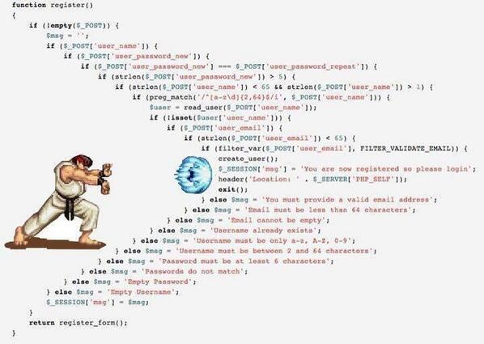

## Super TypeScript II Turbo

### FP Edition

---



---

### Strategy Goals

- Lightweight
- Adaptable
- Simple
- Dependable once mastered

---


---

### Players' Guide

- Basics
- Combos
- Specials
- Techniques

---

## Basic Moves

---

### Pure Functions

```typescript
function addNumbers (x: number, y: number): number {
  return x + y;
}

const combineStrings = (x: string, y: string): string => x + y;
```

---

```typescript
function updatePosition (
  position: Point2D,
  direction: Vector2D
): Point2D {
  const tempVector = Vector2D.from(position);
  const newPosition: Vector2D = Vector2D.add(
    tempVector,
    direction
  );
  return Point2D.from(newPosition);
}
```

---

### Why?

- No races; no surprises
- Easy to debug
- "Referencial Transparency"

---

### Higher Order Functions

```typescript
const rememberX = (x: number): ()=>number => (): number => x;
const x23 = rememberX(23);
const x42 = rememberX(42);

x23(); // 23
x42(); // 42
```

```typescript
const compare = (
  test: (x: number, y: number) => boolean,
  x: number,
  y: number
): number => {
  return test(x, y) ?  1
       : test(y, x) ? -1
       : 0;
};
```

---

```typescript
const clamp = (min: number, max: number) => (x: number) =>
  Math.max(min, Math.min(x, max));

const clampX = clamp(leftWall.x, rightWall.x);
const x = clampX(position.x);
```

```typescript
type NumberTest = (x: number, y: number) => boolean;
const compare = (test: NumberTest) => (x: number, y: number) =>
    test(x, y) ?  1
  : test(y, x) ? -1
  : 0;

[3, 1, 2].sort(compare((x, y) => x > y));
```

---

### Why?

- Reusable
- Configurable
- Separate the "how" from the "what"
- Combinable

---

### Map / Filter

```typescript
const toUpperCase = (text: string): string => text.toUpperCase();
["a", "b", "c"].map<string>(toUpperCase); // ["A", "B", "C"]
```

```typescript
const greaterThan2 = [1, 2, 3, 4, 5].filter(x => x > 2);
```

---

```typescript
interface Coordinate2D {
  x: number;
  y: number;
}

const toPoint2D = ({ x, y }: Coordinate2D): Point2D =>
  new Point2D(x, y);
```

```typescript
const enemiesInRange = enemies
  .filter(enemy => isInRange(enemy.position, rangeDimensions));
```

---

### Why?

- Separate logic from flow
- Simple pattern
- Paradigm applies to more than just Arrays
- Easy to chain

---

## Combos

---

Combine higher-order functions, to transform one piece of data.

```typescript
const updatedPlayer =
  updateAnimationFrame(
    updatePosition(player));
```

---

Compose is, itself, a higher-order function that helps do this.

```typescript
type Transform<A, B> = (x: A)=>B;

const compose = <A, B, C>(
    g: Transform<B, C>,
    f: Transform<A, B>
) => (x: A): C => {
  return g(f(x));
};
```

```typescript
const addOneAndDouble = compose(
  (x: number) => x * 2,
  (x: number) => x + 1
);

const sixString = addOneAndDouble(2);
```

---

Chain map and filter calls to transform sets of data.

```typescript
const injuredEnemies = enemies
  .filter(inRangeOf(rangeDimensions))
  .map(dealDamage(DAMAGE_VALUE));
```
---

Mapping is not about loops!

---

It hides the array loop,  
but it's really about moving from A -> B.  
It doesn't matter if there is one or a dozen.

```typescript
const mapAToB = (x: A):B => new B(x);

const a: A = new A();
const b: B = mapAToB(a);
```

```typescript
const as: A[] = [new A(), new A()];
const bs: B[] = as.map(mapAToB);
```

---

Promises are similar to arrays in their use of `then`.

```typescript
getData()
  .then(castToObjects)
  .then(filterBy(userCriteria))
  .then(displayData);
```

---

Observables are similar to arrays in their methods.

```typescript
getData$()
  .map(castToObjects)
  .filter(filterBy(userCriteria))
  .subscribe(displayData);
```

---

### Why?

- Very easy to reason about with practice
- Data flows through a pipeline
- Easy to add / remove / change links in the chain
- Easy to use composed functions as a link in a different chain
- If every link is pure, the whole chain is pure
- Very testable - test the logic, chain the logic, test the chain

---

## Special Moves

- Readonly<Type>
- Pick<Key, Type>
- Record<Key, Type>
- Async / Await


---

### Readonly<Type>

Guarantees that the compiler will treat function input or output as immutable.

```typescript
function nobodyMessesWith <T>(x: T): Readonly<T> { return x; }

const baby = nobodyMessesWith(new Baby());
baby.inCorner = true; // COMPILER ERROR
```

```typescript
function updatePoint (point: Readonly<Point2D>): Point2D {
  point.x += 1; // COMPILER ERROR
}
```
---

### Pick<KeyType, Type>


---

### Async / Await

If you want to guarantee 
```typescript

```